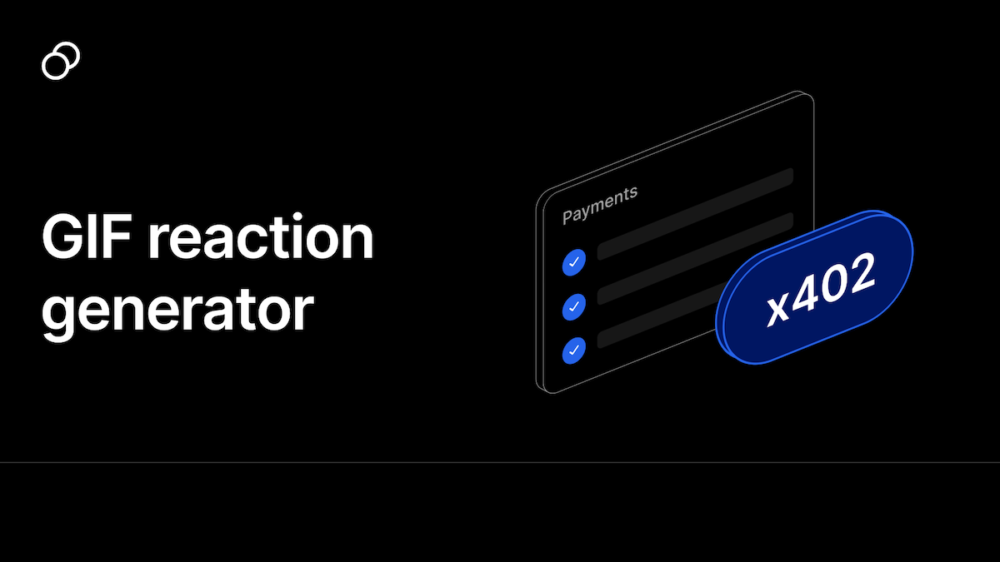

# Reaction GIF Generator



A simple AI-powered app that generates the perfect reaction GIF for any situation. Describe a feeling or scenario, and the app uses AI to find the most relevant and funny GIF.

**Each generation costs $0.01**, paid via the [x402 payment protocol](https://portal.thirdweb.com/x402).

## How It Works

1. User enters a description (e.g., "when my code finally compiles")
2. AI analyzes the text and extracts reaction keywords
3. Searches Giphy for matching GIFs
4. AI selects the best match from the results
5. User downloads the perfect reaction GIF

## x402 Payment Integration

This app demonstrates how to monetize an API using thirdweb's x402 payment protocol. The integration requires just two pieces:

### Server-side: `settlePayment()`

In the API route, we verify and settle the payment before processing:

```typescript
import { settlePayment, facilitator } from "thirdweb/x402";

const paymentResult = await settlePayment({
  resourceUrl: new URL("/api/generate", request.url).toString(),
  method: "POST",
  paymentData: request.headers.get("x-payment"),
  payTo: process.env.SERVER_WALLET_ADDRESS!,
  network: defineChain(143), // Monad
  price: "$0.01",
  facilitator: thirdwebFacilitator,
});

if (paymentResult.status !== 200) {
  // Return 402 Payment Required
  return Response.json(paymentResult.responseBody, {
    status: paymentResult.status,
    headers: paymentResult.responseHeaders,
  });
}

// Payment verified — continue with the request
```

### Client-side: `useFetchWithPayment()`

On the frontend, replace `fetch()` with the payment-aware hook:

```typescript
import { useFetchWithPayment } from "thirdweb/react";

const { fetchWithPayment, isPending } = useFetchWithPayment(client);

// Automatically handles 402 responses, wallet connection, and payment
const data = await fetchWithPayment("/api/generate", {
  method: "POST",
  body: JSON.stringify({ text: input }),
});
```

The hook automatically:

- Shows a wallet connection modal if needed
- Handles the payment flow when a 402 is returned
- Retries the request with the payment header

## Getting Started

1. Clone the repo and install dependencies:

```bash
pnpm install
```

2. Create `.env.local` with your API keys:

```
NEXT_PUBLIC_THIRDWEB_CLIENT_ID=...
THIRDWEB_SECRET_KEY=...
THIRDWEB_SERVER_WALLET_ADDRESS=0x...
OPENAI_API_KEY=...
GIPHY_API_KEY=...
```

3. Run the development server:

```bash
pnpm dev
```

Open [http://localhost:3000](http://localhost:3000) to try it out.

## Learn More

- [x402 Documentation](https://portal.thirdweb.com/x402) — Learn more about the x402 payment protocol
- [thirdweb SDK](https://portal.thirdweb.com/typescript/v5) — Full SDK documentation
